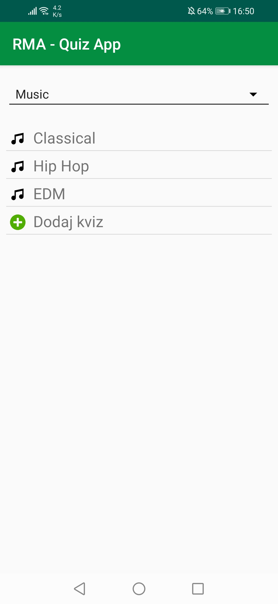
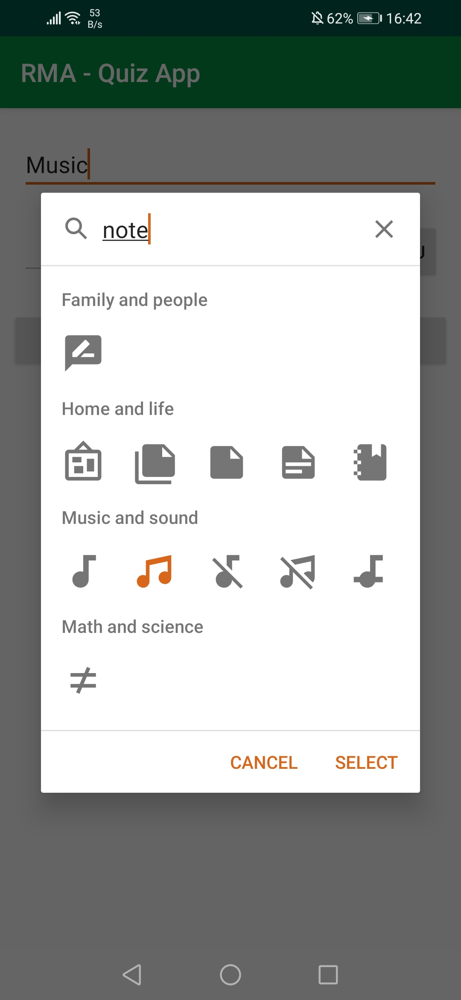
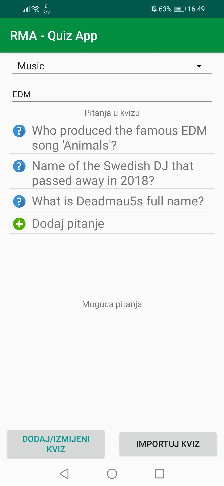
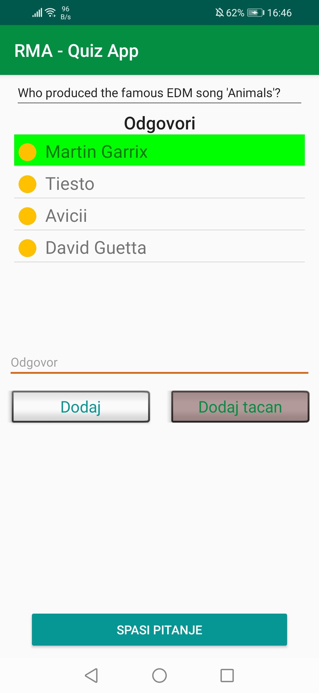
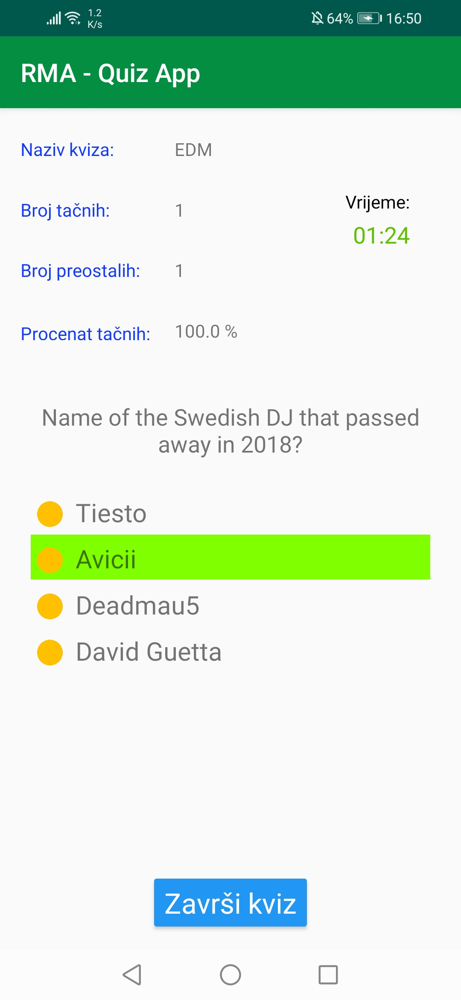
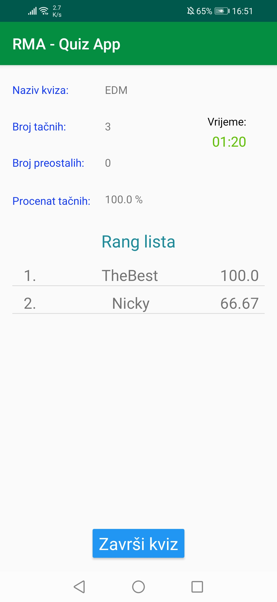

#### Faculty of Electrical Engineering, Sarajevo
#### Mobile application development 2018/2019

---

RMA - Quiz App is, in essence, an application for creating and playing quizzes. It that can be used by multiple users in parallel and can work in online and offline mode. 

Some relevant features include:
  - Create quiz category
  - Create/Edit quiz
  - Create a quiz question
  - Overview of all present categories, quizzes and questions
  - Import a quiz via CSV file
  - Online/Offline mode
  - Playing the quiz
  - Quiz timer
  - Ranking list
  
The app uses Cloud Firestore to store relevant game informations (online mode) and SQLite (offline mode)

  

  

You can download the debug APK file at [RMA - Quiz App](ttps://drive.google.com/file/d/1oMC4sgFCS3ERFA_oWFU32uDR8P6qYsZe/view?usp=sharing)
